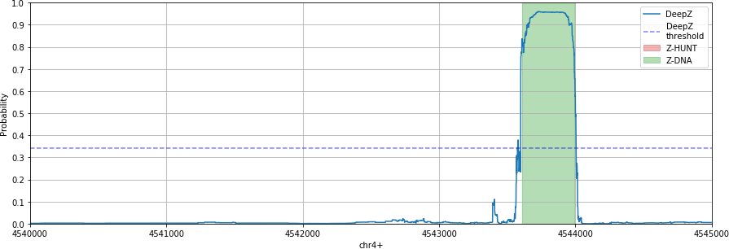

# Appendix for DeepZ paper

Here you can find the whole human genome (hg19) annotation.

### annotation folder

The folder contains experimental ZDNA regions, ZHUNT prediction and the whole genome annotation in regions format and in prebabilities format

### images folder

The folder contains images of real DeepZ predictions

#### Image example: 

### Annotation.ipynb

Notebook that can create images from images folder
